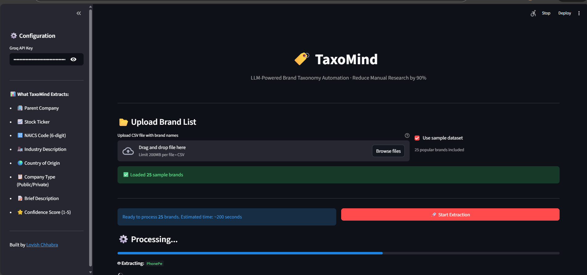
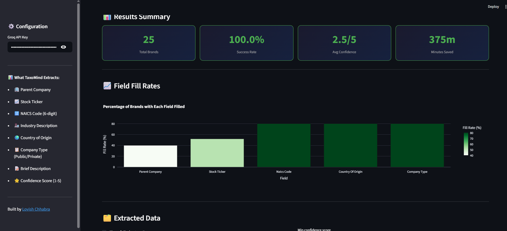
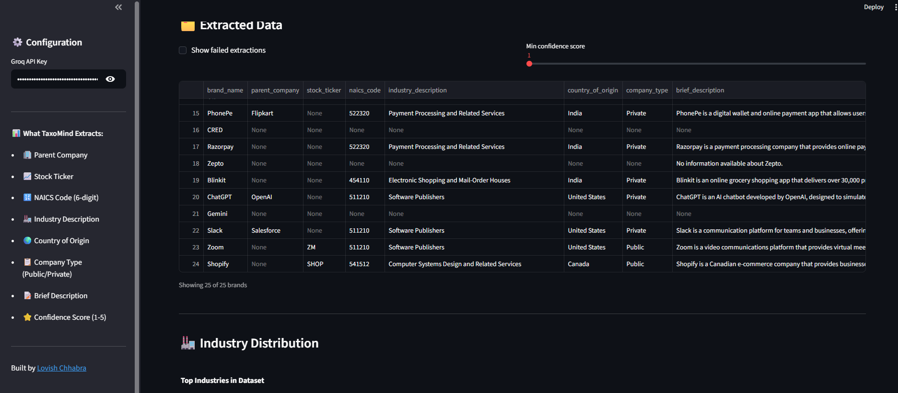
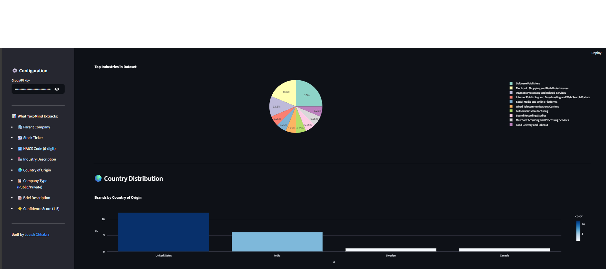

# 🏷️ TaxoMind — LLM-Powered Brand Taxonomy Automation

<p align="center">
  
  
  
  
  
</p>

> Upload a list of brand names. TaxoMind automatically extracts **Parent Company, Stock Ticker, NAICS Code, Industry, Country, Company Type and Description** using LLMs and real-time web search — reducing manual research effort by **90%**.

---

## 🚀 Demo









---

## 💡 The Problem This Solves

In financial services and data operations, analysts often need to classify thousands of brands with their parent company, industry codes, and ticker symbols. Manually researching each brand one by one:
- Takes **15-20 minutes per brand**
- Is error-prone and inconsistent
- Doesn't scale to large datasets

TaxoMind automates this entirely using **Groq LLaMA 3.3 + DuckDuckGo search**, processing each brand in seconds with a confidence score for quality assurance.

---

## ✨ What It Extracts

| Field | Example |
|---|---|
| 🏢 Parent Company | Alphabet Inc. |
| 📈 Stock Ticker | GOOGL |
| 🔢 NAICS Code | 519130 |
| 🏭 Industry Description | Internet Publishing and Broadcasting |
| 🌍 Country of Origin | United States |
| 📋 Company Type | Public |
| 📝 Brief Description | YouTube is a video sharing platform... |
| ⭐ Confidence Score | 5/5 |

---

## 🏗️ Architecture

```
User uploads brands.csv
        ↓
processor.py — batch orchestration
        ↓
    ┌───────────────────────────────┐
    │  For each brand:              │
    │  1. searcher.py               │
    │     DuckDuckGo web search     │
    │     → search context          │
    │                               │
    │  2. extractor.py              │
    │     Groq LLaMA 3.3            │
    │     → structured JSON         │
    │                               │
    │  3. Confidence scoring        │
    │     LLM rates quality 1-5     │
    └───────────────────────────────┘
        ↓
app.py — results table + charts + export
        ↓
Download CSV / Excel
```

---

## ⚙️ Setup

### 1. Clone
```bash
git clone https://github.com/chhabralovish/taxomind-brand-taxonomy.git
cd taxomind-brand-taxonomy
```

### 2. Install
```bash
python -m venv .venv
.venv\Scripts\activate
pip install -r requirements.txt
```

### 3. Configure
```bash
cp .env.example .env
# Add GROQ_API_KEY
```

### 4. Run
```bash
streamlit run app.py
```

---

## 📂 CSV Format

Your input CSV should have a column with brand names:

```csv
brand_name
YouTube
Instagram
Spotify
Tesla
```

Any column name containing "brand", "company", or "name" works. Otherwise the first column is used.

---

## 📁 Project Structure

```
taxomind-brand-taxonomy/
│
├── app.py              # Streamlit UI — upload, process, visualise, export
├── extractor.py        # LLM extraction + confidence scoring
├── searcher.py         # DuckDuckGo web search per brand
├── processor.py        # Batch processing orchestration
├── sample_data/
│   └── brands.csv      # 25 sample brands to test with
├── requirements.txt
├── .env.example
└── README.md
```

---

## 📊 Output

Results are available as:
- **Interactive table** in the dashboard with confidence filtering
- **CSV download** — ready for any downstream system
- **Excel download** — with data + summary sheet

---

## 👨‍💻 Author

**Lovish Chhabra** — Data Scientist & AI Engineer

[](https://www.linkedin.com/in/lovish-chhabra/)
[](https://github.com/chhabralovish)

---

## 📄 License

MIT License